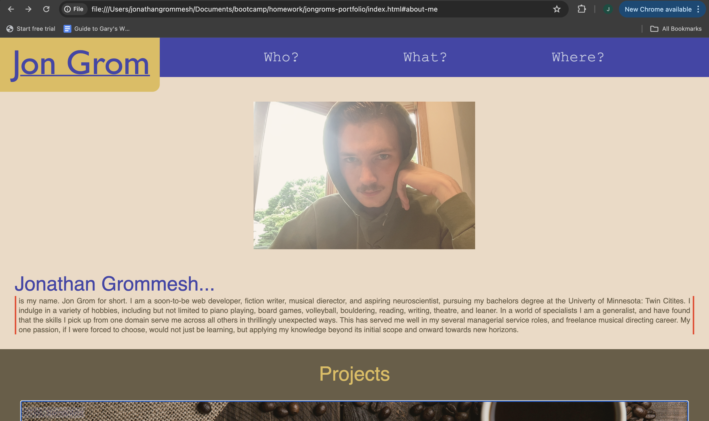

# Semantic HTML Homework

In this assignment I built a portfolio web page from scratch. The webpage includes a header with my name and an interactive nav bar; a picture of myself; an about me section; a projects section with links to my single completed project and placeholder projects linked to a placeholder page; and finally a contact section with my number, email, and a link to my github. The webpage reactively shifts to accomodate various viewport sizes. 

## Link to Deployed Version
[Click here to see the deployed version](https://jongrom.github.io/jongrom-s-portfolio/)

## Screenshot of the Deployed Version
